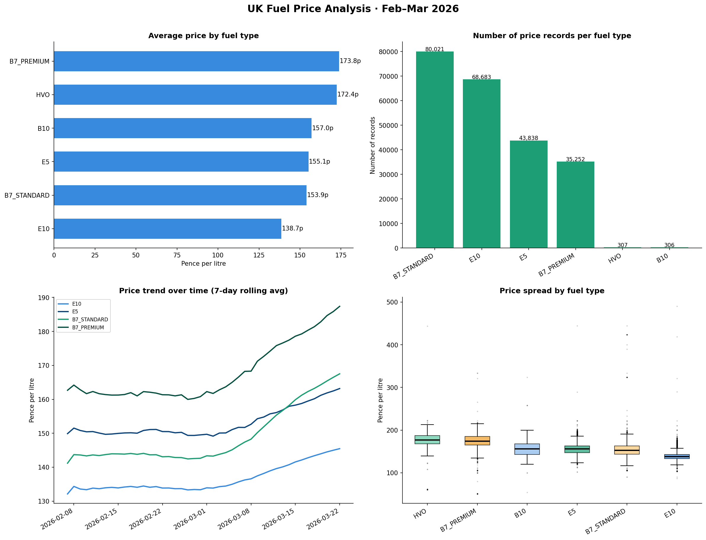
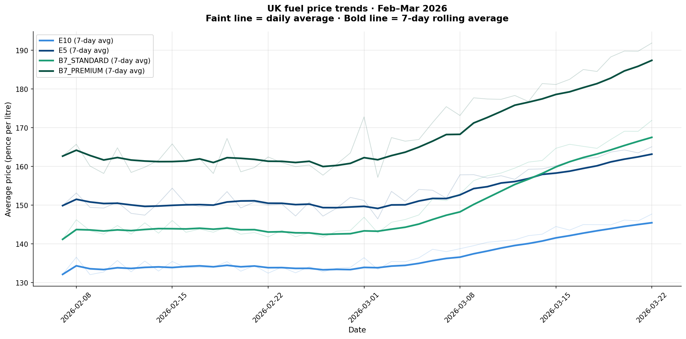
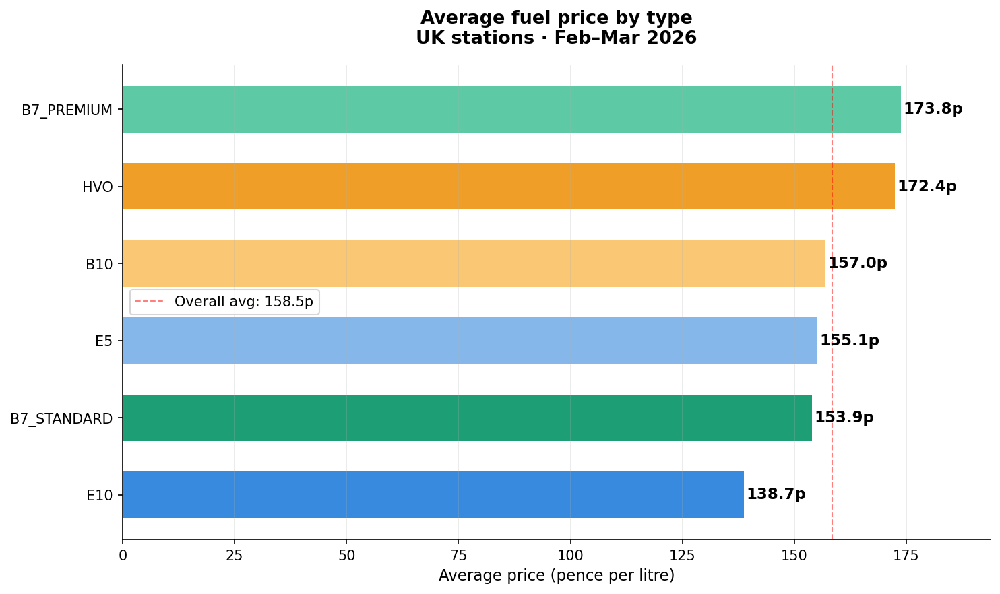
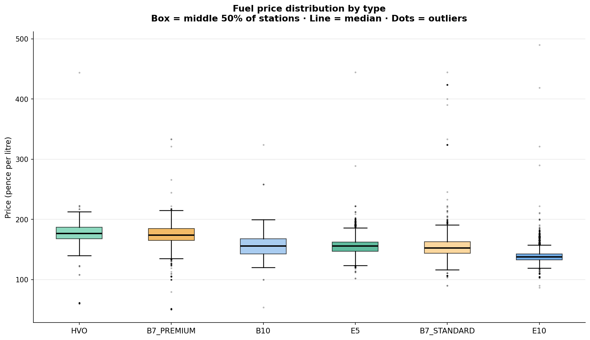

# Fule Price in Uk 



## Project Summary
This project performs an in-depth analysis of fuel prices in the United Kingdom, focusing on understanding historical trends, price behavior, and the relationship between petrol and diesel prices.

The project applies data analytics techniques to transform raw data into meaningful insights using Python-based tools and visualization techniques.

## Business Understanding
Fuel price fluctuations directly impact:
- Transportation and logistics costs
- Consumer spending
- Economic planning

This analysis helps identify patterns in fuel pricing and provides a foundation for forecasting and decision-making.

## Objectives
- Analyze fuel price trends
- Compare petrol and diesel pricing behavior
- Detect patterns, volatility, and anomalies
- Generate actionable insights through visualization

## Tech Stack
- **Python**
- **Pandas** – Data cleaning & manipulation
- **NumPy** – Numerical operations
- **Matplotlib & Seaborn** – Visualization
- **Jupyter Notebook**

## Project Structure

Fuel-Price-UK/
│
├── data/ # Raw dataset
├── notebooks/ # Analysis notebook
├── images/ # Saved visualizations
└── README.md

## Visualizations & Insights

### 1. Fuel Price Trend Over Time


**Analysis:**
- prices of fuel are sky rockting evry month 
- Long-term upward trend indicates inflation and global market influence

---

### 2. Petrol Price Comparison by their type


**Analysis:**
- B7_premium is the heighest selling petrol with higher penny
- b7-premimum and HVO fule type are expenvive over 150p 
---

### 3. Price Distribution by their pirce


**Analysis:**
- no outlier found in any fuel type
- loweest selling petrol type E10

---

## 🔍 Key Insights
- Fuel prices are highly volatile and influenced by external global factors
- Petrol prices are strongly influenced the economy of county 
- There is a gradual long-term increase in fuel prices
- Seasonal trends suggest recurring patterns in price changes

## Skills Demonstrated
- Data Cleaning & Preprocessing
- Exploratory Data Analysis (EDA)
- Data Visualization
- Time-Series Analysis Basics
- Analytical Thinking

##  How to Run

### 1. Clone Repository
```bash
git clone https://github.com/suzzzel5/Fule-Price-UK.git
cd Fule-Price-UK


